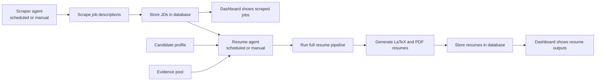

# Hermes Autonomous Resume

Hermes Autonomous Resume is a Hermes-based job application system with two cooperating agents: a scraper agent that collects jobs and a resume agent that generates resumes customized to each job description.

The system is designed to run continuously. The scraper agent can run on a schedule to collect jobs and store them in the database, where they appear in the dashboard. The resume agent can run on its own schedule to process all scraped job descriptions through the full resume pipeline, then store the generated LaTeX and PDF outputs in the database so they can also be reviewed in the dashboard.

At a high level, the product combines:

- a scraper agent that acquires job descriptions and stores them for review
- a resume agent that reads candidate truth and evidence, runs the full pipeline, and stores generated resumes

## System View

## What This Repo Contains

- the Hermes skills that power candidate setup, evidence intake, JD processing, resume generation, and orchestration
- scraper utilities for collecting jobs
- the docs site for running the system or building your own version

## Core Skills

| Skill | Description |
|---|---|
| `profile-bootstrap` | Personalizes the repo for a real candidate and fills runtime placeholders. |
| `candidate-profile` | Stores the candidate truth the rest of the resume system reads from. |
| `pool-intake` | Adds work, project, and OSS evidence into the expected pool structure. |
| `jd-prefilter` | Quickly rejects weak-fit job descriptions before deeper processing. |
| `jd-extraction` | Turns a job description into structured signals for downstream resume work. |
| `project-selection` | Chooses the strongest supporting project and OSS evidence for a JD. |
| `point-repointing` | Tailors experience and project bullets to the target job description. |
| `latex-assembly` | Assembles the final resume output in LaTeX form. |
| `resume-pipeline-orchestrator` | Runs the end-to-end resume flow and pushes results to the dashboard. |

## Read The Docs

If you want to run this system yourself or build your own version, start here:

- Docs: https://hermes-autonomous-resume.vercel.app/docs/getting-started/introduction
- Docs source: [docs-site/docs/getting-started/introduction.md](docs-site/docs/getting-started/introduction.md)

Recommended doc entry points:

- `Getting Started` for installation and first-run context
- `Resume Agent` for the operator workflow
- `Scraper Agent` for the job collection workflow
- `Architecture` for system boundaries and lifecycle
- `API Reference` if you are building your own dashboard/backend
