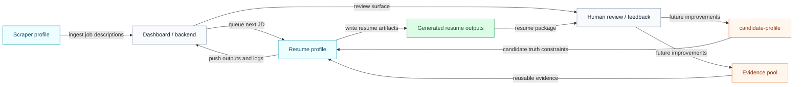

# Hermes Autonomous Resume

Hermes Autonomous Resume is a skill-based resume automation system built around two cooperating workflows:

- a scraper flow that acquires job descriptions
- a resume flow that reads candidate truth and evidence, generates tailored resumes, and pushes results to a dashboard

This repository is intentionally not fully explained in the README. The detailed setup, operator workflow, architecture, pipeline stages, and API contracts live in the docs site.

## System View

## What This Repo Contains

- Hermes skills for candidate setup, evidence intake, JD processing, resume generation, and orchestration
- scraper utilities for job acquisition
- a Docusaurus docs site that explains how to run or adapt the system

## Read The Docs

If you want to use, deploy, or rebuild this system yourself, start here:

- Local docs: http://localhost:3000/docs/getting-started/introduction
- Docs source: [docs-site/docs/getting-started/introduction.md](docs-site/docs/getting-started/introduction.md)

Recommended doc entry points:

- `Getting Started` for installation and first-run context
- `Resume Agent` for the operator workflow
- `Architecture` for system boundaries and lifecycle
- `API Reference` if you are building your own dashboard/backend

The README stays intentionally minimal. The docs are the canonical place for setup and implementation details.
