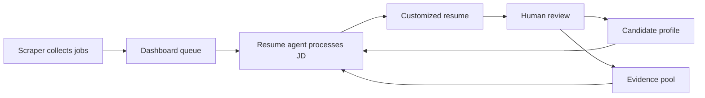

# Hermes Autonomous Resume

Hermes Autonomous Resume is a Hermes-based resume agent that helps you apply to jobs with resumes customized to each job description.

The system is designed to run continuously: collect jobs on a schedule, generate tailored resumes from grounded candidate evidence, push them into a dashboard review flow, and improve future runs through explicit human feedback.

At a high level, the product combines:

- a scraper flow that acquires job descriptions
- a resume flow that reads candidate truth and evidence, builds JD-specific resumes, and pushes them for review

## System View

## What This Repo Contains

- the Hermes skills that power candidate setup, evidence intake, JD processing, resume generation, and orchestration
- scraper utilities for collecting jobs
- the docs site for running the system or building your own version

## Core Skills

| Skill | Description |
|---|---|
| `profile-bootstrap` | Personalizes the repo for a real candidate and fills runtime placeholders. |
| `candidate-profile` | Stores the candidate truth the rest of the resume system reads from. |
| `pool-intake` | Adds work, project, and OSS evidence into the expected pool structure. |
| `jd-prefilter` | Quickly rejects weak-fit job descriptions before deeper processing. |
| `jd-extraction` | Turns a job description into structured signals for downstream resume work. |
| `project-selection` | Chooses the strongest supporting project and OSS evidence for a JD. |
| `point-repointing` | Tailors experience and project bullets to the target job description. |
| `latex-assembly` | Assembles the final resume output in LaTeX form. |
| `resume-pipeline-orchestrator` | Runs the end-to-end resume flow and pushes results to the dashboard. |

## Read The Docs

If you want to run this system yourself or build your own version, start here:

- Docs: https://hermes-autonomous-resume.vercel.app/docs/getting-started/introduction
- Docs source: [docs-site/docs/getting-started/introduction.md](docs-site/docs/getting-started/introduction.md)

Recommended doc entry points:

- `Getting Started` for installation and first-run context
- `Resume Agent` for the operator workflow
- `Architecture` for system boundaries and lifecycle
- `API Reference` if you are building your own dashboard/backend
