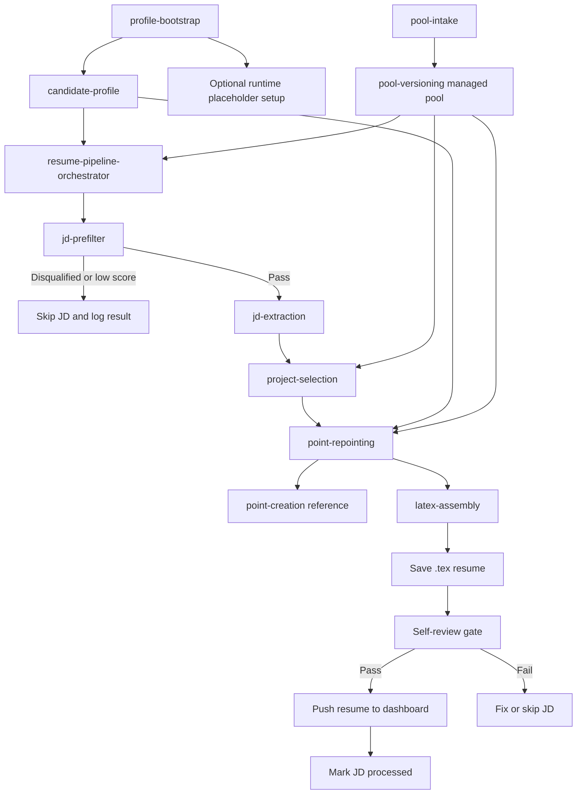

# Hermes Autonomous Resume

Reusable skill-based resume pipeline for tailoring resumes against job descriptions.

For full setup and architecture docs, see the Docusaurus site in [`docs-site/`](D:/Desktop/projects/hermes-autonomous-resume/docs-site).

## Start Here

Before running anything else:

1. Run `profile-bootstrap` to set up the repository for the current candidate.
2. Fill `candidate-profile` with the candidate's real facts, role scope, seniority, work authorization, hard disqualifiers, provable skills, strongest signals, and career direction.
3. If needed, let `profile-bootstrap` also replace runtime placeholders such as `<PROFILE_SLUG>`, `<POOL_DIR>`, `<RESUMES_DIR>`, `<DASHBOARD_BASE_URL>`, and `<DASHBOARD_API_KEY_ENV>`.
4. Add candidate evidence into the pool with `pool-intake` before expecting good resume output.
5. Use `resume-pipeline-orchestrator` only after the profile and pool are ready.

Recommended first-run order:

```text
profile-bootstrap
-> pool-intake
-> resume-pipeline-orchestrator
```

## Skill Map

| Skill | What It Does | When To Use It |
|---|---|---|
| `profile-bootstrap` | Collects the minimum user inputs needed to personalize the repo for a real candidate. | First-time setup or major candidate refresh. |
| `candidate-profile` | Source of truth for candidate facts, role targeting, provable skills, and hard disqualifiers. | Read and update whenever candidate data changes. |
| `pool-intake` | Adds new project, OSS, or work-experience source material into the pool in the required structure. | When onboarding raw candidate evidence. |
| `pool-versioning` | Defines the pool structure, file schemas, and read/write boundaries. | When reading or writing anything in the pool. |
| `jd-prefilter` | Quickly filters and scores job descriptions using `candidate-profile`. | Before running the full tailoring pipeline. |
| `jd-extraction` | Extracts must-haves, behavioral signals, scope signals, and culture signals from a JD. | After a JD passes pre-filter. |
| `project-selection` | Chooses the strongest personal and OSS items for a specific JD. | After JD extraction. |
| `point-repointing` | Re-aims existing experience and project bullets toward the selected JD. | After project selection. |
| `point-creation` | Reference method for writing and compressing high-quality resume bullets. | Used by `point-repointing` when shaping bullets. |
| `latex-assembly` | Builds the final tailored resume as a compilable LaTeX file. | Final content step before push/export. |
| `resume-pipeline-orchestrator` | Runs the end-to-end batch pipeline and pushes finished resumes to the dashboard workflow. | When the system is fully configured and ready to process JDs. |

## Pipeline Flow



## User Workflow

### 1. Configure The Candidate

Use `profile-bootstrap` first. This is the setup entry point for the whole repo.

It should gather:
- candidate identity and current search scope
- target roles and seniority
- work authorization and hard disqualifiers
- provable skills
- strongest signals and career direction
- optional runtime values for the orchestrator

### 2. Build The Evidence Pool

Use `pool-intake` to add:
- projects
- OSS contributions
- work experience

The pipeline is only as good as the evidence in the pool. If the pool is thin or sloppy, the tailored resumes will be weak.

### 3. Run The Pipeline

Use `resume-pipeline-orchestrator` once the profile and pool are ready.

At a high level it:
- fetches a batch of job descriptions
- runs `jd-prefilter`
- deeply extracts passing JDs with `jd-extraction`
- selects supporting projects with `project-selection`
- rewrites bullets with `point-repointing`
- assembles the final resume with `latex-assembly`
- pushes successful resumes and logs outcomes

## Core Rule

`candidate-profile` is the only place candidate-specific filtering and scoring assumptions should live. Other skills should read from it, not hard-code one person's geography, seniority, authorization path, or role preferences.
