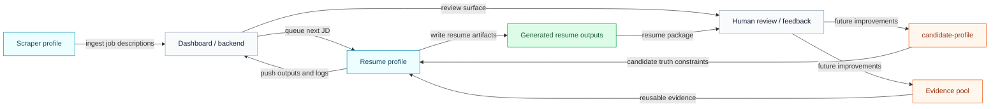

# Hermes Autonomous Resume

Hermes Autonomous Resume is a Hermes-based resume agent that helps you apply to jobs with resumes customized to each job description.

The system is designed to run continuously: collect jobs on a schedule, generate tailored resumes from grounded candidate evidence, push them into a dashboard review flow, and improve future runs through explicit human feedback.

At a high level, the product combines:

- a scraper flow that acquires job descriptions
- a resume flow that reads candidate truth and evidence, builds JD-specific resumes, and pushes them for review

This repository is intentionally not fully explained in the README. The detailed setup, operator workflow, architecture, pipeline stages, and API contracts live in the docs site.

## System View

## What This Repo Contains

- the Hermes skills that power candidate setup, evidence intake, JD processing, resume generation, and orchestration
- scraper utilities for collecting jobs
- the docs site for running the system or building your own version

## Read The Docs

If you want to run this system yourself or build your own version, start here:

- Docs: https://hermes-autonomous-resume.vercel.app/docs/getting-started/introduction
- Docs source: [docs-site/docs/getting-started/introduction.md](docs-site/docs/getting-started/introduction.md)

Recommended doc entry points:

- `Getting Started` for installation and first-run context
- `Resume Agent` for the operator workflow
- `Architecture` for system boundaries and lifecycle
- `API Reference` if you are building your own dashboard/backend

The README stays intentionally minimal. The docs are the canonical place for setup and implementation details.
