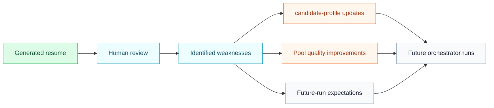

import SourceRepoNote from '@site/src/components/SourceRepoNote';

# Feedback loop

Hermes only becomes better over time when people review generated resumes, identify what was weak or missing, and explicitly feed those improvements back into the candidate inputs and evidence sources that the next run will use.

This page describes the lifecycle after a generated resume already exists. It is the improvement model for future runs, not a claim that Hermes silently retrains or self-mutates during live execution.

## What feedback can change

Grouped by target, useful feedback can change:

- `candidate-profile` assumptions: location constraints, seniority framing, role-family fit, allowed claims, or stale candidate facts that need correction through explicit setup updates
- Pool completeness and quality: missing work entries, thin project evidence, weak OSS proof, stale metrics, or poorly structured source files that limit selection quality
- Selection and tailoring quality: whether the chosen supporting evidence was the right evidence and whether the resume framing was too generic or too weak for the target JD
- Prefilter strictness: whether the system is skipping too aggressively, passing weak-fit roles, or using outdated disqualifiers
- Review gate expectations: what the operator should require before a resume is pushed, accepted, or marked ready for human use

## What feedback must not do

- It must not silently mutate the current run halfway through execution.
- It must not rewrite candidate truth without an explicit update to the candidate-owned source inputs.
- It must not change downstream skill behavior invisibly. If behavior needs to change, update the source inputs or document the logic change in the owning workflow.

Those boundaries keep the system auditable. A reviewer should be able to explain why a later run improved by pointing to changed candidate setup, improved evidence, or documented pipeline logic.

## Operator loop

Use the improvement cycle like this:

1. Run resumes for real JDs.
2. Review outcomes in the dashboard or your review process.
3. Update candidate truth or evidence sources when the review exposes a real gap.
4. Rerun future JDs with the improved inputs.

That is the practical meaning of "self-improving" in Hermes: the system improves because operators maintain better inputs and evidence, not because it autonomously edits itself behind the scenes.

## Where to make those updates

- Use [Candidate Setup](/docs/setup/candidate-setup) when the issue is candidate truth, constraints, or stale assumptions in `candidate-profile`.
- Use [Pool Content Guide](/docs/resume-agent/pool-content-guide) when the issue is missing, weak, or badly structured evidence in the pool.
- Use [Resume Agent](/docs/resume-agent/overview) for the operating workflow that turns those inputs into future runs.
- Use [API Reference](/docs/api-reference) if your review flow depends on dashboard feedback or workflow endpoints.

<SourceRepoNote>
  If you want the actual profile, pipeline, and skill assets referenced on this page, use the public source repository.
</SourceRepoNote>
