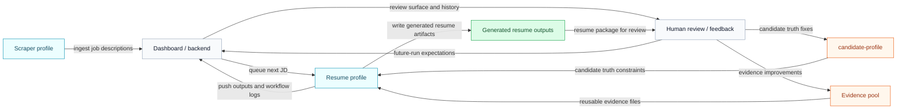

import SourceRepoNote from '@site/src/components/SourceRepoNote';

# System design

Hermes resume automation is a set of cooperating subsystems with clear ownership boundaries. The system is not just "the resume pipeline." It includes one profile that acquires job descriptions, one profile that turns those descriptions into resumes, external dashboard services that hold the operating queue and review surface, and runtime storage that preserves candidate truth, reusable evidence, and generated outputs across runs.

Read this page first if you want the operator view: what the major systems are, how information moves between them, and where the important boundaries sit before you dive into detailed workflow or stage docs.

This diagram shows the main system shape from job intake through generated output and human feedback.

## What each system owns

- The scraper profile owns JD acquisition. It finds or receives job descriptions, then hands them to the dashboard queue.
- The dashboard and backend own queue state, generated output records, workflow logging, and review surfaces.
- The resume profile owns candidate-aware processing. It fetches queued JDs, reads candidate truth and pool evidence, runs the resume pipeline, and produces outputs.
- `candidate-profile` owns truth constraints about the candidate: what is factual, what is allowed to be claimed, and what fit assumptions downstream stages may use.
- The evidence pool owns reusable files for work experience, personal projects, and OSS contributions that the resume profile can select from and tailor.

## Cross-system flow

At runtime, information moves in one direction through the live path:

1. The scraper profile sends job descriptions into the dashboard.
2. The resume profile fetches the next queued JD from the dashboard.
3. The resume profile reads `candidate-profile` plus the pool to decide what the candidate can honestly claim and which evidence best supports the role.
4. The pipeline generates resume artifacts and pushes the results back to the dashboard.
5. Humans review the generated resume and feed improvements back into candidate truth, pool content, or future-run expectations.

This Architecture section stops there on purpose. If you want the operator sequence, read [Resume Agent](/docs/resume-agent/overview). If you want the internal pipeline stages, read [Pipeline Overview](/docs/pipeline/overview).

## Runtime boundaries

- The scraper and resume workflows should stay in separate Hermes profiles. One profile owns JD acquisition; the other owns candidate-aware resume generation.
- The dashboard is external to the Hermes skills. It is an operational service boundary, not part of the prompt or skill bundle.
- The evidence pool and generated resume outputs live in runtime storage on the VPS or wherever Hermes runs. They are operating data, not conceptual docs-only objects.
- `candidate-profile` is the candidate truth boundary. Downstream skills should consume it, not invent parallel candidate facts.
- Feedback should affect future runs by updating source inputs, evidence quality, or review expectations. It should not silently mutate an in-flight execution.

## Read next

- [Resume Agent](/docs/resume-agent/overview) for the operator workflow and setup sequence
- [Pipeline Overview](/docs/pipeline/overview) for the internal JD-processing stages
- [API Reference](/docs/api-reference) for dashboard request and response contracts
- [Feedback Loop](/docs/architecture/feedback-loop) for how review improves future runs without hidden adaptation

That sequence is intentional: this page defines the system shape, Resume Agent explains how to operate it, Pipeline explains how processing works internally, and API Reference explains the backend contracts.

<SourceRepoNote>
  If you want the actual skills, scraper files, and repository pieces behind this diagram, use the public source repository.
</SourceRepoNote>
