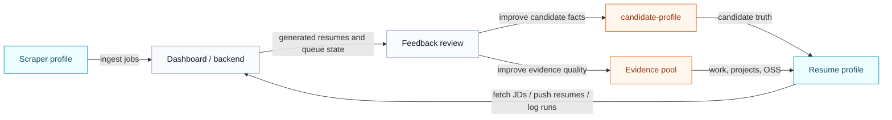

import SourceRepoNote from '@site/src/components/SourceRepoNote';

# System design

Hermes is easiest to understand as a loop of four systems:

1. job intake
2. candidate-aware filtering and tailoring
3. dashboard delivery
4. feedback-driven improvement

This diagram shows the system boundaries and the main handoffs between profiles, backend services, and persistent candidate data.

- The scraper and resume agent should stay in separate Hermes profiles.
- `candidate-profile` and the evidence pool feed the resume profile.
- Feedback should improve future inputs, not silently mutate a live run.

## Components

### Job scraper

Finds or receives new job descriptions and sends them into the dashboard.

### Dashboard

Acts as the operational queue and output surface:

- stores incoming JDs
- stores generated resumes
- tracks processed state
- captures human feedback

### Pipeline repository

This repository owns the candidate-aware tailoring logic and output construction.

### Feedback loop

Human review should influence future profile updates, pool improvements, ranking logic, and quality checks.

<SourceRepoNote>
  If you want the actual skills, scraper files, and repository pieces behind this diagram, use the public source repository.
</SourceRepoNote>
