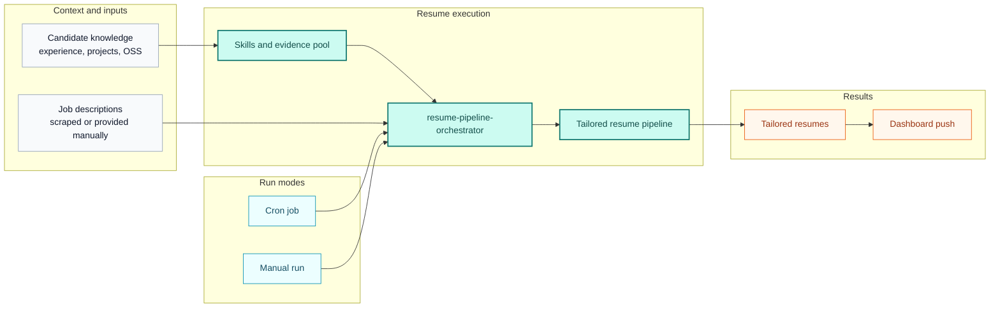

# Hermes Resume Agent

Getting Started

  

    This documentation explains how to use the Hermes agentic framework to build a resume agent that generates tailored resumes from personal knowledge, including work experience, projects, and open-source contributions.
  

  

    The system follows a straightforward workflow. A scraper agent collects new jobs on a schedule, typically in the morning. After that, the resume agent runs the full pipeline for each scraped job description, generates a tailored resume, and pushes the result to the dashboard.
  

  

    The dashboard used in this setup is a custom implementation, but it can be replaced with any equivalent interface. What matters is that the required backend API contracts are available and integrated correctly. This documentation will include a dedicated section for each API so those integration points can be referenced clearly during implementation.
  

  

    This resume system uses multiple Hermes skills internally, but the operator workflow is simpler than that. Users set up the candidate with <code>profile-bootstrap</code>, add evidence with <code>pool-intake</code>, and then run <code>resume-pipeline-orchestrator</code> manually or on a cron schedule.
  

  

    The goal of these docs is to show how a Hermes-based resume system can be built, deployed on private infrastructure, and adapted to different workflows.
  

## Why Hermes

The main reason for using Hermes here is its self-learning loop. Over time, the resume agent can use feedback from generated resumes to improve how it writes, what it emphasizes, and how well it aligns with stronger ATS outcomes. That makes Hermes a good fit for a system that is meant to improve over the long run rather than produce one-off outputs.

Hermes is also useful because it follows instructions well. In this resume workflow, that matters because the agent should stay grounded in real candidate information and avoid fabricating experience, achievements, or skills that are not actually supported by the source material.

## How it works

You can run this resume system in two ways, depending on how automated you want the workflow to be.

- Set up a cron job to run the pipeline on a schedule, such as every morning after new job descriptions have been collected.
- Run the pipeline manually whenever you want to process a job description batch on demand.

In both cases, the flow stays the same: the system reads candidate knowledge, takes scraped or provided job descriptions, runs the resume pipeline through the orchestrator, generates tailored resumes, and pushes the results to the dashboard.

The important usability rule is: users do not normally invoke every downstream resume skill one by one. The orchestrator handles that internal sequence.

## Skills

This resume system uses a small set of focused skills to move a job description through the pipeline. Each skill handles one part of the flow, and the orchestrator ties them together so the run can happen consistently whether it is scheduled or manual.

Core skills in this setup include:

- scraper-related skills for collecting jobs
- API-related skills for dashboard and backend integration
- candidate and evidence skills for storing personal knowledge
- resume-generation skills for processing job descriptions and creating tailored resumes
- `resume-pipeline-orchestrator` for running the whole pipeline

## Deployment

In the reference setup documented here, the system runs on a Hostinger VPS, the agents are deployed there, and OpenRouter is used for model access.

The scraper, resume pipeline, and API integrations are documented here so the same approach can be reused in other environments.

## What you can build

- Building your own Hermes-style resume bot
- Running automated resume generation from scraped jobs
- Managing the workflow through reusable skills
- Deploying the agents on your own VPS
- Connecting the system to your own dashboard or backend

## Start here

Choose the route that matches what you want to do next.

  <a className="docCardLink" href="/docs/getting-started/installation">
    <h3>Installation</h3>
    
Install the docs site locally and understand the runtime prerequisites for the pipeline.

  </a>
  <a className="docCardLink" href="/docs/resume-agent/setup-guide">
    <h3>Resume Agent Setup</h3>
    
Follow the main onboarding path for profile setup, pool prep, and run readiness.

  </a>
  <a className="docCardLink" href="/docs/resume-agent/pool-content-guide">
    <h3>Pool Content Guide</h3>
    
Load work history, projects, and OSS evidence in the structure the pipeline expects.

  </a>
  <a className="docCardLink" href="/docs/resume-agent/how-it-works">
    <h3>How It Works</h3>
    
See the end-to-end flow from candidate profile and pool content to dashboard push.

  </a>
  <a className="docCardLink" href="/docs/pipeline/orchestrator">
    <h3>Orchestrator</h3>
    
Understand how the end-to-end batch runner coordinates the skills and dashboard calls.

  </a>
  <a className="docCardLink" href="/docs/architecture/system-design">
    <h3>System Design</h3>
    
View the bigger Hermes loop: scraper, dashboard, pipeline, and feedback.

  </a>

