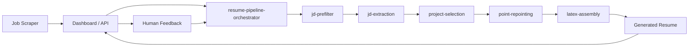

# Hermes at a glance

Hermes is an autonomous resume pipeline built around reusable skills. It ingests job descriptions, compares them against a candidate profile, selects supporting evidence from a structured pool, rewrites resume bullets for the specific role, assembles a final resume, and pushes the result into a dashboard workflow.

This repository is the pipeline layer. It is designed to work inside a broader Hermes loop where:

- a separate agent or service scrapes jobs
- the dashboard stores incoming job descriptions and generated resumes
- the orchestrator fetches work from that dashboard
- feedback on generated resumes informs future improvements

## What this repo contains

- reusable skills for filtering, extraction, selection, bullet tailoring, and LaTeX assembly
- a candidate profile contract used as the system's source of truth
- a bootstrap skill for onboarding a new candidate
- orchestrator instructions for running the full pipeline in sequence

## Why the skill split matters

The pipeline is intentionally broken into small, explicit skills so each stage has a narrow contract:

- `candidate-profile` owns candidate-specific truth
- `jd-prefilter` decides whether a JD is worth deeper work
- `jd-extraction` turns the JD into structured signals
- `project-selection` chooses the best proof assets
- `point-repointing` retargets bullets without inventing claims
- `latex-assembly` produces the final resume artifact
- `resume-pipeline-orchestrator` coordinates the run

## High-level system shape

## Start here

If you are setting Hermes up for a new candidate, begin with:

1. [Installation](./installation)
2. [Candidate setup](../setup/candidate-setup)
3. [Pool intake](../setup/pool-intake)
4. [First run](./first-run)
