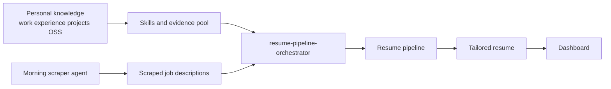

# Hermes Resume Agent

Getting Started

  

    This documentation explains how to build Hermes, a resume agent that generates tailored resumes from personal knowledge, including work experience, projects, and open-source contributions.
  

  

    The system follows a straightforward workflow. A scraper agent collects new jobs on a schedule, typically in the morning. After that, the resume agent runs the full pipeline for each scraped job description, generates a tailored resume, and pushes the result to the dashboard.
  

  

    The dashboard used in this setup is a custom implementation, but it can be replaced with any equivalent interface. What matters is that the required backend API contracts are available and integrated correctly. This documentation will include a dedicated section for each API so those integration points can be referenced clearly during implementation.
  

  

    Hermes uses multiple skills to run the resume pipeline. The main coordination layer is the <code>resume-pipeline-orchestrator</code>, which manages the full pipeline and produces the final resume outputs.
  

  

    The goal of these docs is to show how this system can be built, deployed on private infrastructure, and adapted to different workflows.
  

## Workflow

- Build resumes from real candidate knowledge instead of generic prompting
- Scrape new jobs automatically through a scraper agent
- Run the resume pipeline against each scraped job description
- Generate tailored resumes and push them to a dashboard
- Use reusable skills and an orchestrator to manage the full system

## Skills

Hermes is built from multiple skills, each responsible for a specific part of the workflow. The orchestrator connects those skills and manages the end-to-end pipeline.

Important parts of the system include:

- scraper-related skills for collecting jobs
- API-related skills for dashboard and backend integration
- candidate and evidence skills for storing personal knowledge
- resume-generation skills for processing job descriptions and creating tailored resumes
- `resume-pipeline-orchestrator` for running the whole pipeline

## Deployment

In the reference setup documented here, the system runs on a Hostinger VPS, the agents are deployed there, and OpenRouter is used for model access.

The scraper, resume pipeline, and API integrations are documented here so the same approach can be reused in other environments.

## What you can build

- Building your own Hermes-style resume bot
- Running automated resume generation from scraped jobs
- Managing the workflow through reusable skills
- Deploying the agents on your own VPS
- Connecting the system to your own dashboard or backend

## Start here

Choose the route that matches what you want to do next.

  <a className="docCardLink" href="/docs/getting-started/installation">
    <h3>Installation</h3>
    
Install the docs site locally and understand the runtime prerequisites for the pipeline.

  </a>
  <a className="docCardLink" href="/docs/setup/candidate-setup">
    <h3>Candidate Setup</h3>
    
Use <code>profile-bootstrap</code> to configure Hermes for a real candidate.

  </a>
  <a className="docCardLink" href="/docs/setup/pool-intake">
    <h3>Pool Intake</h3>
    
Load work history, projects, and OSS evidence so the pipeline has something real to work from.

  </a>
  <a className="docCardLink" href="/docs/pipeline/overview">
    <h3>Pipeline Overview</h3>
    
See how JDs move through filtering, extraction, selection, repointing, assembly, and push.

  </a>
  <a className="docCardLink" href="/docs/pipeline/orchestrator">
    <h3>Orchestrator</h3>
    
Understand how the end-to-end batch runner coordinates the skills and dashboard calls.

  </a>
  <a className="docCardLink" href="/docs/architecture/system-design">
    <h3>System Design</h3>
    
View the bigger Hermes loop: scraper, dashboard, pipeline, and feedback.

  </a>

## Customization

This repository documents how the Hermes system is structured so it can be reproduced and adapted to other stacks.
