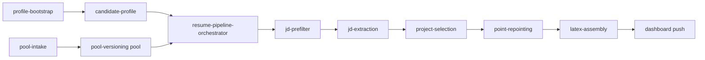
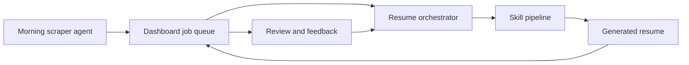

# Hermes at a glance

Getting Started

Hermes is a bot for building tailored resumes from your own real knowledge: work experience, projects, and open-source contributions. Instead of rewriting a resume manually for every role, Hermes turns your background into structured evidence, matches that evidence against incoming job descriptions, generates a targeted resume, and pushes the output into a dashboard workflow.

The goal of this documentation is to show how someone can build that system for themselves. This repo covers the pipeline, the skills, the orchestration layer, and the integration points needed to run Hermes on your own infrastructure.

This repository sits inside a broader Hermes loop where:

- a scraper agent collects new jobs, typically on a morning schedule
- the dashboard stores scraped job descriptions and generated resumes
- the resume pipeline processes each scraped job description end to end
- the orchestrator coordinates the skills and pushes results back to the dashboard
- feedback can be used later to improve the system

## Why Hermes helps

Hermes exists to make resume tailoring operational instead of ad hoc.

- It starts from a **real candidate knowledge base** instead of generic prompting.
- It turns work history, projects, and OSS into a **structured evidence pool** the pipeline can reuse.
- It breaks the workflow into **clear skills and stages** instead of one opaque prompt.
- It supports **batch processing of scraped jobs** rather than one manual resume rewrite at a time.
- It pushes outputs into a **dashboard workflow** so resume generation is tracked and reviewable.

Hermes owns the candidate-aware decision and resume-generation layer between job scraping and the dashboard.

## How Hermes works

Hermes has two connected sides: first it prepares candidate truth and evidence, then it runs a live job-processing pipeline against scraped roles.

| Layer | What it does |
|---|---|
| Candidate setup | Fills `candidate-profile` and runtime placeholders with real candidate-specific values. |
| Evidence layer | Structures work experience, projects, and OSS contributions into the pool for downstream reuse. |
| Scraping layer | Collects new jobs and places those job descriptions into the dashboard queue. |
| Pipeline layer | Filters, extracts, selects, repoints, assembles, and reviews a tailored resume for each job. |
| Delivery layer | Pushes generated resumes back to the dashboard and records processing outcomes. |

## What this system is built from

Hermes is intentionally broken into small, explicit skills so each stage has a narrow contract.

The key pieces are:

- `candidate-profile` for candidate-specific truth
- `pool-intake` and related pool structure for storing evidence
- scraper and API-related skills for collecting jobs and integrating with external services
- `jd-prefilter` for deciding whether a JD is worth deeper work
- `jd-extraction` for turning the JD into structured signals
- `project-selection` for choosing the strongest supporting proof
- `point-repointing` for tailoring bullets without inventing claims
- `latex-assembly` for producing the final resume artifact
- `resume-pipeline-orchestrator` for coordinating the entire pipeline run

The orchestrator is especially important because it is the layer that manages the full resume pipeline. It ties the skills together, processes scraped job descriptions, and generates the final outputs.

## Deployment model

In the reference setup documented here:

- the agents run on a VPS hosted on Hostinger
- the model calls go through OpenRouter
- the scraper, pipeline, and API integration are split into skills
- the dashboard can be custom-built by anyone, as long as it can work with the backend API contracts

This means you do not need to copy the exact dashboard implementation used here. You can build your own dashboard or workflow UI, but the pipeline still needs stable API endpoints to fetch jobs, push resumes, and track results.

## Use it for

Use Hermes when you need more than a one-off prompt that rewrites a resume once.

- Build a reusable resume bot around your own experience and projects.
- Process batches of scraped job descriptions automatically.
- Keep candidate constraints, signals, and proof points consistent across every run.
- Tailor resumes from structured evidence instead of rewriting from scratch each time.
- Push outputs into a dashboard workflow instead of keeping results in isolated local files.
- Run the system on your own VPS and adapt it to your own UI or backend.

## Start here

Choose the route that matches what you want to do next.

  <a className="docCardLink" href="/docs/getting-started/installation">
    <h3>Installation</h3>
    
Install the docs site locally and understand the runtime prerequisites for the pipeline.

  </a>
  <a className="docCardLink" href="/docs/setup/candidate-setup">
    <h3>Candidate Setup</h3>
    
Use <code>profile-bootstrap</code> to configure Hermes for a real candidate.

  </a>
  <a className="docCardLink" href="/docs/setup/pool-intake">
    <h3>Pool Intake</h3>
    
Load work history, projects, and OSS evidence so the pipeline has something real to work from.

  </a>
  <a className="docCardLink" href="/docs/pipeline/overview">
    <h3>Pipeline Overview</h3>
    
See how JDs move through filtering, extraction, selection, repointing, assembly, and push.

  </a>
  <a className="docCardLink" href="/docs/pipeline/orchestrator">
    <h3>Orchestrator</h3>
    
Understand how the end-to-end batch runner coordinates the skills and dashboard calls.

  </a>
  <a className="docCardLink" href="/docs/architecture/system-design">
    <h3>System Design</h3>
    
View the bigger Hermes loop: scraper, dashboard, pipeline, and feedback.

  </a>

## Community and extension

This repo is the pipeline layer of a larger Hermes system. The scraper, dashboard, and feedback handling can evolve independently as long as the pipeline contracts stay clear.

If you are extending the system, keep these boundaries stable:

- candidate truth belongs in `candidate-profile`
- evidence belongs in the pool
- orchestration belongs in `resume-pipeline-orchestrator`
- scraping belongs in the scraper layer
- external product surfaces belong in the dashboard and surrounding Hermes services
