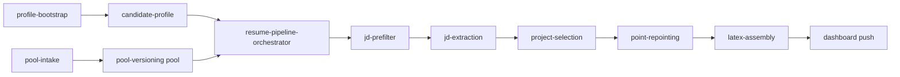
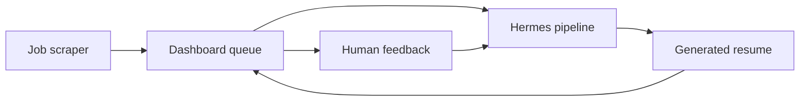

# Hermes at a glance

Getting Started

Hermes is an autonomous resume pipeline built around reusable skills. It ingests job descriptions, compares them against a candidate profile, selects supporting evidence from a structured pool, rewrites resume bullets for the specific role, assembles a final resume, and pushes the result into a dashboard workflow.

This repository is the pipeline layer. It is designed to work inside a broader Hermes loop where:

- a separate agent or service scrapes jobs
- the dashboard stores incoming job descriptions and generated resumes
- the orchestrator fetches work from that dashboard
- feedback on generated resumes informs future improvements

## Why Hermes helps

Hermes exists to make resume tailoring operational instead of ad hoc.

- It gives the system a **candidate-aware source of truth** before any JD is scored.
- It turns scattered work history and projects into a **structured evidence pool**.
- It breaks resume tailoring into **auditable stages** instead of one opaque generation step.
- It pushes results back into a **dashboard and feedback loop** so the system can improve over time.

Hermes complements job scraping and dashboard tooling by owning the candidate-aware decision and tailoring layer in the middle.

## How Hermes works

Hermes has two connected sides: it prepares candidate truth and evidence, then serves that context into a live JD-processing pipeline.

| Layer | What it does |
|---|---|
| Candidate setup | Fills `candidate-profile` and optional runtime placeholders with real user-specific values. |
| Evidence layer | Structures work experience, projects, and OSS into the pool for downstream reuse. |
| Pipeline layer | Filters, extracts, selects, repoints, assembles, and reviews a tailored resume. |
| Delivery layer | Pushes resumes into the dashboard and records processing outcomes. |

## What this repo contains

The pipeline is intentionally broken into small, explicit skills so each stage has a narrow contract:

- `candidate-profile` owns candidate-specific truth
- `jd-prefilter` decides whether a JD is worth deeper work
- `jd-extraction` turns the JD into structured signals
- `project-selection` chooses the best proof assets
- `point-repointing` retargets bullets without inventing claims
- `latex-assembly` produces the final resume artifact
- `resume-pipeline-orchestrator` coordinates the run

## Use it for

Use Hermes when you need more than a one-off prompt that rewrites a resume once.

- Filter large JD batches before spending tokens on full tailoring.
- Keep candidate constraints, signals, and proof points consistent across every run.
- Tailor resumes from structured evidence instead of rewriting from scratch each time.
- Push outputs into a dashboard workflow instead of keeping results in isolated local files.
- Improve the system over time through explicit feedback rather than silent drift.

## Start here

Choose the route that matches what you want to do next.

  <a className="docCardLink" href="/docs/getting-started/installation">
    <h3>Installation</h3>
    
Install the docs site locally and understand the runtime prerequisites for the pipeline.

  </a>
  <a className="docCardLink" href="/docs/setup/candidate-setup">
    <h3>Candidate Setup</h3>
    
Use <code>profile-bootstrap</code> to configure Hermes for a real candidate.

  </a>
  <a className="docCardLink" href="/docs/setup/pool-intake">
    <h3>Pool Intake</h3>
    
Load work history, projects, and OSS evidence so the pipeline has something real to work from.

  </a>
  <a className="docCardLink" href="/docs/pipeline/overview">
    <h3>Pipeline Overview</h3>
    
See how JDs move through filtering, extraction, selection, repointing, assembly, and push.

  </a>
  <a className="docCardLink" href="/docs/pipeline/orchestrator">
    <h3>Orchestrator</h3>
    
Understand how the end-to-end batch runner coordinates the skills and dashboard calls.

  </a>
  <a className="docCardLink" href="/docs/architecture/system-design">
    <h3>System Design</h3>
    
View the bigger Hermes loop: scraper, dashboard, pipeline, and feedback.

  </a>

## Community and extension

This repo is the pipeline layer of a larger Hermes system. The job scraper, dashboard, and feedback handling can evolve independently as long as the pipeline contracts stay clear.

If you are extending the system, keep these boundaries stable:

- candidate truth belongs in `candidate-profile`
- evidence belongs in the pool
- orchestration belongs in `resume-pipeline-orchestrator`
- external product surfaces belong in the dashboard and surrounding Hermes services
