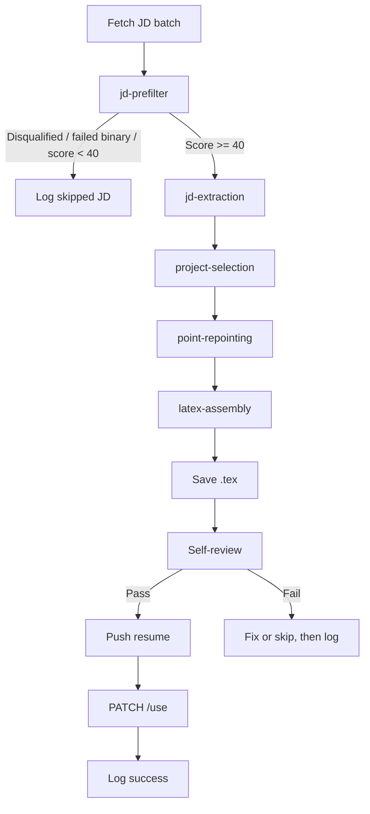

# Orchestrator

`resume-pipeline-orchestrator` is the execution layer that ties the skills together for live JD processing.

If you want the actual orchestrator and downstream skill files referenced here, use the public source repository:

- [hermes-autonomous-resume on GitHub](https://github.com/Aryan1718/hermes-autonomous-resume)

For the full operator path, see [Resume Agent > Run and Verify](/docs/resume-agent/run-and-verify). This page stays focused on the orchestrator's role inside the broader pipeline.

## Responsibilities

- fetch unprocessed job descriptions from the dashboard
- load `candidate-profile`
- skip JDs that are disqualified, fail the binary gate, or score below `40`
- run `jd-extraction`, `project-selection`, `point-repointing`, and `latex-assembly` sequentially for JDs scoring `40+`
- save the generated `.tex` locally
- run the mandatory self-review gate before any push
- push successful resumes, PATCH `/use`, and log outcomes

## Control flow

## Important rule

The orchestrator should consume candidate-specific truth from `candidate-profile`. It should not introduce its own hidden assumptions about location, sponsorship, seniority, or role fit.

Manual one-off debugging can invoke individual skills directly, but normal JD processing should start with `resume-pipeline-orchestrator` only.
