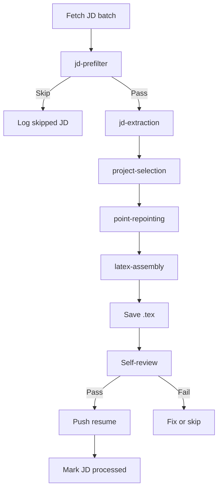

# Orchestrator

`resume-pipeline-orchestrator` is the execution layer that ties the skills together for live JD processing.

## Responsibilities

- fetch unprocessed job descriptions from the dashboard
- load `candidate-profile`
- run `jd-prefilter`
- run the deeper pipeline for passing JDs
- save and push final resumes
- mark successful JDs as processed
- log failures and skipped items

## Control flow

## Important rule

The orchestrator should consume candidate-specific truth from `candidate-profile`. It should not introduce its own hidden assumptions about location, sponsorship, seniority, or role fit.
