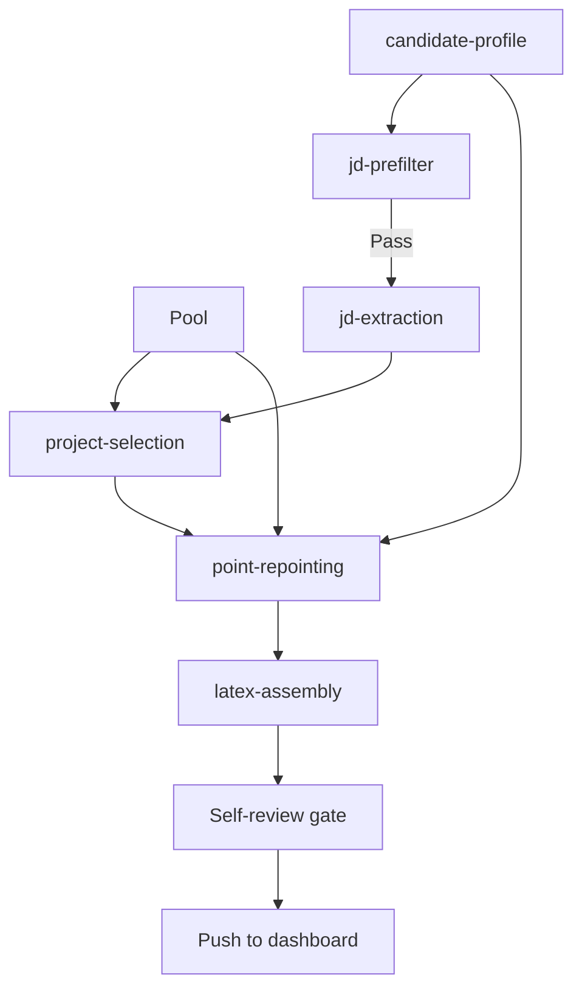

# Pipeline overview

The Hermes resume pipeline is a staged process that narrows, enriches, and tailors information rather than trying to produce a final resume in one jump.

## Stage purposes

- `jd-prefilter`: reject obvious bad fits quickly
- `jd-extraction`: turn raw JD text into structured downstream signals
- `project-selection`: pick the best supporting evidence
- `point-repointing`: reshape bullets toward the JD without inventing facts
- `latex-assembly`: build the final resume artifact

## Why this split works

Each stage reduces one failure mode:

- prefilter reduces wasted compute on bad roles
- extraction reduces vague JD interpretation
- selection reduces irrelevant proof points
- repointing reduces generic resumes
- assembly reduces format drift
