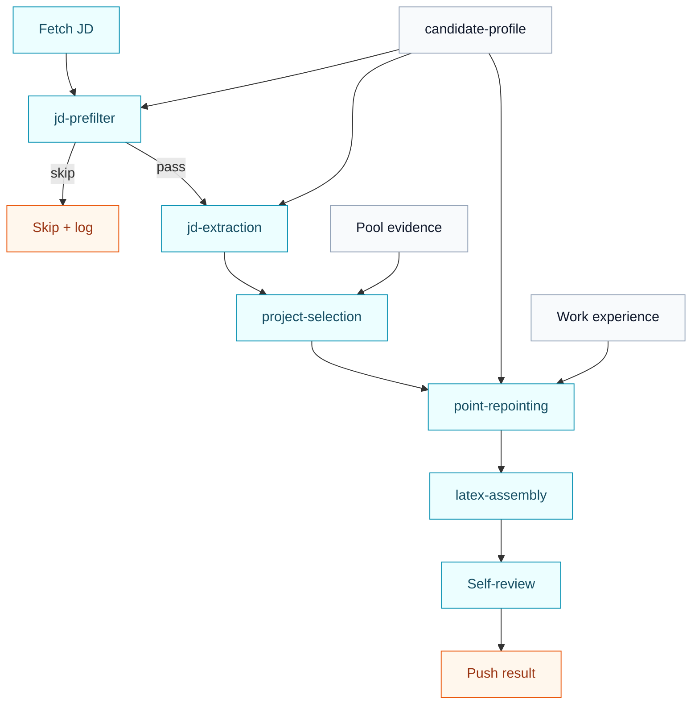

import SourceRepoNote from '@site/src/components/SourceRepoNote';

# Pipeline overview

The Hermes resume pipeline is a staged process that narrows, enriches, and tailors information rather than trying to produce a final resume in one jump.

For the operator-facing walkthrough, use [Resume Agent](/docs/resume-agent/overview). This page is the compact internal pipeline reference.

This is the internal runtime stage flow from a queued JD to a pushed resume result.

- `candidate-profile` influences filtering, extraction, and tailoring.
- Pool evidence feeds project selection.
- The orchestrator handles the stage sequence.

## Stage purposes

- `resume-pipeline-orchestrator`: fetch JDs, call downstream stages, and handle push and logging
- `jd-prefilter`: reject obvious bad fits quickly
- `jd-extraction`: turn raw JD text into structured downstream signals
- `project-selection`: choose supporting projects and OSS evidence only
- `point-repointing`: tailor selected projects plus all work experience without inventing facts
- `latex-assembly`: build the final resume artifact

## Why this split works

Each stage reduces one failure mode:

- prefilter reduces wasted compute on bad roles
- extraction reduces vague JD interpretation
- selection reduces irrelevant project evidence
- repointing reduces generic resumes
- assembly reduces format drift

See also:

- [Resume Agent > Skill Workflow](/docs/resume-agent/skill-workflow)
- [Resume Agent > Run and Verify](/docs/resume-agent/run-and-verify)

<SourceRepoNote>
  If you want the actual skill files referenced in this section, use the public source repository.
</SourceRepoNote>
