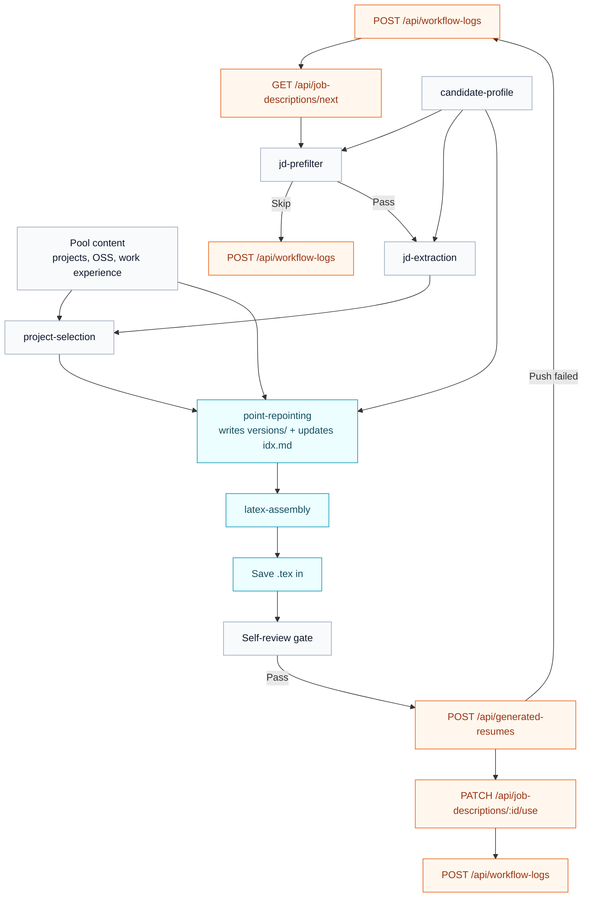

# How It Works

The resume agent is a staged workflow, not one long prompt. It reads candidate truth from `candidate-profile`, pulls evidence from the pool, processes one JD at a time, and writes only at the stages that are supposed to persist state.

For live runs, treat `resume-pipeline-orchestrator` as the operational source of truth for control flow. In the current repo contract, JDs are fetched in a batch, then processed sequentially; JDs that are disqualified, fail the binary gate, or score below `40` are skipped, and JDs at `40+` continue downstream one at a time.

## End-to-end flow

1. Start with a filled `candidate-profile`.
2. Add evidence into the pool with `pool-intake`.
3. Fetch unprocessed JDs through `resume-pipeline-orchestrator`.
4. Run `jd-prefilter` to skip obvious non-fits quickly.
5. Run `jd-extraction` on passing JDs.
6. Run `project-selection` against `masters.md` to choose 3 supporting projects or OSS items.
7. Run `point-repointing` to tailor selected projects plus all work experience.
8. Run `latex-assembly` to produce the final `.tex`.
9. Run the orchestrator self-review gate.
10. Push the resume, mark the JD processed, and log the run.

## Write boundaries

- Read-only stages: `candidate-profile`, `jd-prefilter`, `jd-extraction`, `project-selection`
- Pool-writing stage: `point-repointing`
- Resume-writing stage: `latex-assembly` plus local `.tex` save
- Dashboard API stage: `resume-pipeline-orchestrator`

## Orchestrator flow

## What writes where

| Stage | Writes files? | Calls dashboard APIs? | Output |
|---|---|---|---|
| `candidate-profile` | No | No | Candidate truth |
| `pool-intake` | Yes | No | `raw.md`, `idx.md`, `versions/`, optionally `masters.md` |
| `jd-prefilter` | No | No | Pass/skip decision and score |
| `jd-extraction` | No | No | JD extraction artifact |
| `project-selection` | No | No | 3 selected projects/OSS items |
| `point-repointing` | Yes | No | New version files and updated `idx.md` |
| `latex-assembly` | No pool writes; produces `.tex` content for save | No | Resume LaTeX |
| `resume-pipeline-orchestrator` | Saves `.tex` locally | Yes | Resume push, PATCH `/use`, workflow logs |

Continue to [Setup Guide](/docs/resume-agent/setup-guide) for the first-time operator path.
